*This project has been created as part
of the 42 curriculum by sosanche*

<h1 align="center">Push Swap
</h1>

<p align="center">
  
</p>

## Description

En este proyecto trabajamos con **stacks**, estas son pilas que se controlan con **LIFO** *el último en entrar es el primero en salir*

En este proyecto vamos a tener dos stacks:
- Stack A que contiene números desordenados
- Stack B: stack vacío

Intentando utilizar el menor número de acciones, al final del programa podrás ver los movimientos realizados, los cuáles habrán hecho que los números de Stack A estarán ordenados de menor a mayor *(sin usar sort())*.

<p align="center">
  
</p>

## Instructions

### 0. Plan

Antes de empezar, hice la estructura del repo, que incluye: Makefile, Readme y el header base, aunque a medida que avanza el ejercicio hay que ir actualizándolos.

- **Método:** este ejercicio se puede hacer con arrays o con listas enlazadas, yo lo he hecho con **listas** porque me parece más eficiente y también quiero aprender a utilizar mejor las listas.

### 1. Input

- **Argumentos**: este programa toma los argumentos *(los números que quieres ordenar)* que escribes por, esos números se ordenan de manera que el primero es el top de la pila, he creado una imágen para que sea más visual

<p align="center">
  
</p>

- **Errores de argumentos**:

1. Si no se añaden argumentos en el programa, no se puede ejecutar, esto no es un error como tal, en este caso ``return 0``

``` c
./push-swap.c
```

2. Tenemos que tener en cuenta que los números se pueden añadir de dos formas, y ambas deben ser válidas, para el segundo caso hay que **normalizar la entrada**, para ello utilizo ft_split (*divide con un delimitador, en este caso el delimitador es ' '* )

Yo en este caso para que mi programa funcione igual en los dos casos hago malloc a ambos y utilizo la **misma variable** para apuntarlos, utilizaré esta variable durante todo el programa, así no tengo que utilizar argv en un caso y en el otro no.

``` c
./push-swap.c 1 -3 2 4
./push-swap.c "1 -3 2 4"
```

3. Cuando ya tenemos todos los números separados comprobamos que son números o signos *(0-9/+-)*, e importante, también comprobar que cada argumento *no sea nulo*, por ejemplo si te pasan;

``` c
./push-swap.c 21 3 "" 32
Error
```

4. Tampoco puede sobrepasar **INT_MIN e INT_MAX**, para ello NO he utilizado atoi, si no atol, que es la versión **long**, porque si usas int no puedes comparar los números más altos.

``` c
./push-swap.c "9999999999999"
Error

./push-swap.c "-9999999999999"
Error
```

5. En el caso de los **números duplicados** también debe dar error, he pensado que esto se puede hacer de muchas maneras y en momentos diferentes del código:

- Pensé hacerlo una vez ya ordenado y simplemente comparar cada número con el de atrás y alante pero yo lo veía menos eficiente que hacerlo directamente al principio.
- También utilizando listas, me parecía práctico pero quería mantener el orden de hacer primero el control de argumentos y después las listas.
- Al final lo he hecho con bucles comparando uno a uno, quizás no es lo más ligero si hay muchisimos números pero pienso que para Push Swap es más que suficiente. Esta es la opción más ordenada y que más me gusta.
*(Hay muchas más maneras pero estas son las que se me han ocurrido)*

``` c
./push-swap.c 0 +2 3 5 2
Error

./push-swap.c "43 2 -23 21 -23"
Error
```

6. Despúes del apartado *2. Stacks* cree una función que revisa si los números ya **están ordenados** o no, no tendría sentido avanzar en el programa si ya están ordenados, este caso no es error, return 0.

<p align="center">
  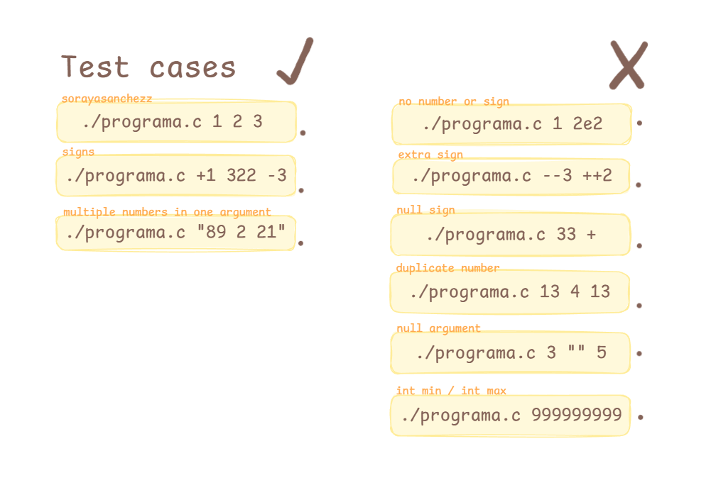
</p>

### 2. Stacks

Como ya he mencionado lo voy a hacer con listas enlazadas:

*Una lista enlazada es una cadena de nodos, donde cada nodo apunta al siguiente. Cada nodo almacena un valor void (lo que quieras), en Push Swap un int. La cabeza de la lista es head, y para acceder al tercer número vas a tener que usar esta para recorrer la lista, ya que aquí no se utilizan índices como en los array*

Para este ejercicio necesitaremos dos estructuras, la estructura del **stack** y la estructura de cada **nodo**

- **Stack**: aquí voy a guardar el nodo de arriba y el número de nodos que hay, esto lo hago para ahorrarme tener que contar los nodos todo el rato
- **Nodo**: se compone de el número y la dirección del siguiente nodo

<p align="center">
  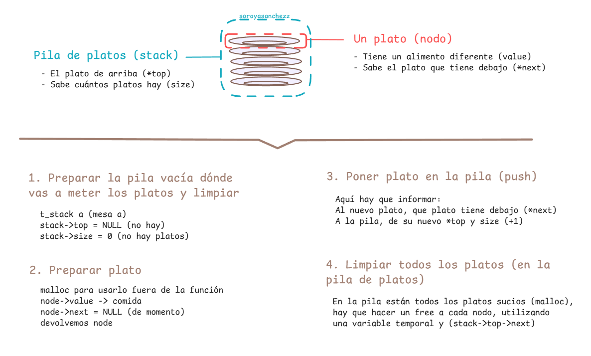
</p>

### 3. Operations

#### Swap

Realmente el swap consiste en entender la lógica de que no puedes intercambiar posiciones sin tener en cuenta el enlace, este ejercicio lo he hecho y recomendaría hacerlo con dibujos para entenderlo mejor. 

<p align="center">
  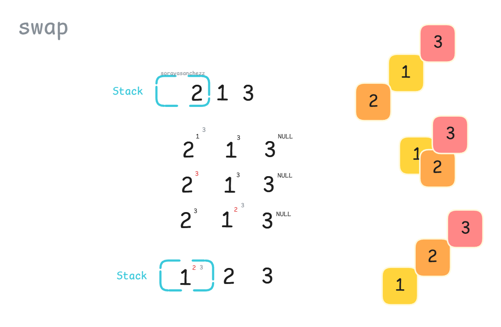
  <br>
</p>

Aquí pongo un ejemplo de tester, que cubre las funciones *is_sorted* y *sa*, para los test he creado una función que imprima una lista, y si esa lista está vacía lo escriba por pantalla.

``` c
print_stack(&a);
sa(&a);
print_stack(&a);
is_sorted(&a);
```

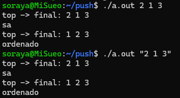

#### Push_Stack

Para este ejercicio hay que tener en cuenta el *stack->size*. 

<p align="center">
  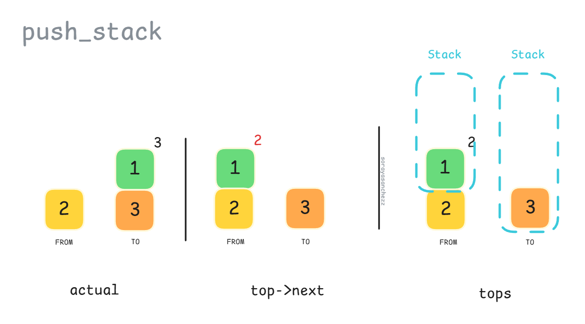
</p>

Aquí otra idea de test, es buena idea ir haciendo **valgrind** mientras haces los test

``` c
print_stack(&a);
print_stack(&b);

pb(&a, &b);
pb(&a, &b);

print_stack(&a);
print_stack(&b);

sb(&b);

print_stack(&a);
print_stack(&b);

pa(&a, &b);

print_stack(&a);
print_stack(&b);
```
<p>
  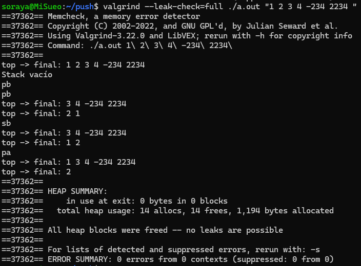
  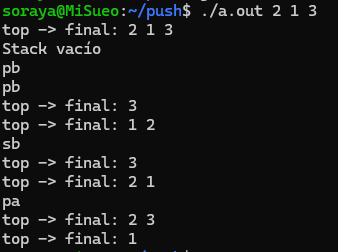
</p>

### Rotate

<p align="center">
  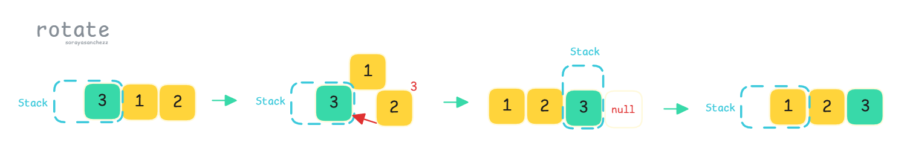
</p>

Idea de test con el resultado:

``` c
print_stack(&a);
print_stack(&b);

pb(&a, &b);
pb(&a, &b);

print_stack(&a);
print_stack(&b);

ra(&a);
rb(&b);

print_stack(&a);
print_stack(&b);

rr(&a, &b);

print_stack(&a);
print_stack(&b);
```

<p>
  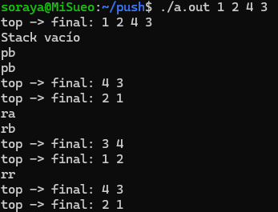
</p>

### Reverse Rotate

<p align="center">
  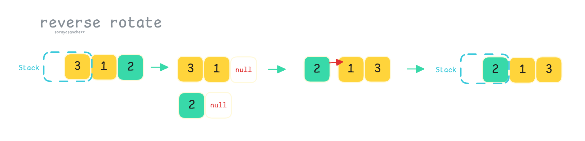
</p>

Idea de test:

``` c
print_stack(&a);
print_stack(&b);

pb(&a, &b);
pb(&a, &b);
pb(&a, &b);

print_stack(&a);
print_stack(&b);

rra(&a);
rrb(&b);

print_stack(&a);
print_stack(&b);

rrr(&a, &b);

print_stack(&a);
print_stack(&b);

rr(&a, &b);

print_stack(&a);
print_stack(&b);
```

<p>
  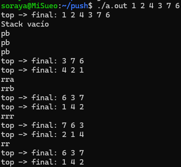
</p>

## 4.Algorithms

Antes de hacer los algoritmos hay que saber a que función enviarlos depende de cuántos números haya, depende de como se haga esto es importante entender la diferencia:

``` c
t_stack a
if (a.size == 2)
```

``` c
t_stack *stack; // dirección de memoria a stack &a
if (a->size == 2)
```

### Two Arguments

Voy a empezar ordenando de menos argumentos a más, para empezar desde lo fácil, realmente en mi *sort_two* no me hace falta validar que no esté ordenado, porque ya lo ha comprobado en *is_sorted*, es muy sencillo, sólo hago un *swap*

### Three Arguments

Para pensar los tres argumentos hay que tener en cuenta que hay 6 combinaciones posibles. Ya tuve en cuenta que estuviera ordenado en *is_sorted*

<p>
  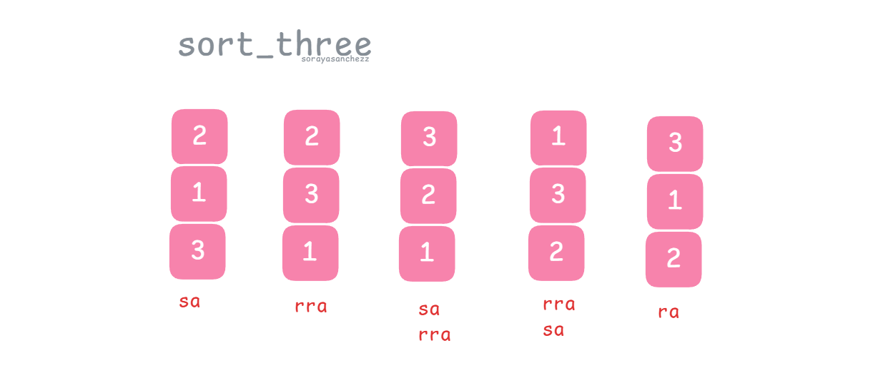
</p>

### Four-Five Arguments

Lo más eficiente con 4-5 argumentos es pasar el número o los dos números más pequeños al *stack b*, para mandar *stack a* a *sort_three*, y después devolver el número pequeño a su stack. En el caso de 5 como pasas el número más pequeño, y luego el segundo más pequeño ya están ordenados al pasarlos.

Para hacer esto he creado una función que me manda el índice del número más pequeño, dependiendo de si está en la parte superior o en la parte inferior *(dividiendo size/2)* hago *ra* o *rra*, esta parte se puede apreciar mejor en el dibujo que he hecho:

<p>
  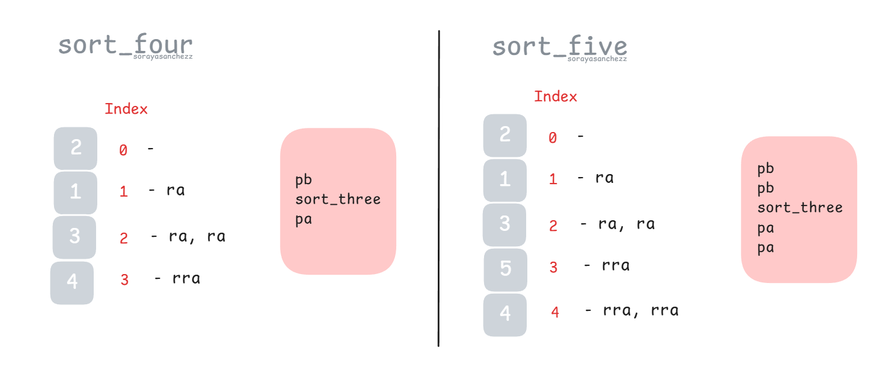
</p>