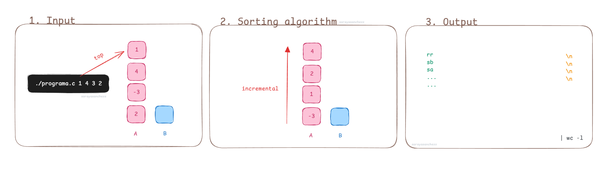
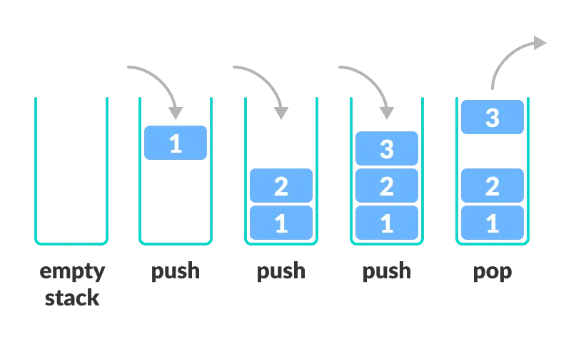
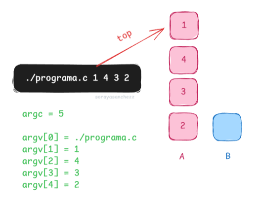

*This project has been created as part
of the 42 curriculum by sosanche*

<h1 align="center">Push Swap
</h1>

<p align="center">
  
</p>

## Description

En este proyecto trabajamos con **stacks**, estas son pilas que se controlan con **LIFO** *el último en entrar es el primero en salir*

En este proyecto vamos a tener dos stacks:
- Stack A que contiene números desordenados
- Stack B: stack vacío

Intentando utilizar el menor número de acciones, al final del programa podrás ver los movimientos realizados, los cuáles habrán hecho que los números de Stack A estarán ordenados de menor a mayor *(sin usar sort())*.

<p align="center">
  
</p>

## Instructions

### 0. Plan

Antes de empezar, hice la estructura del repo, que incluye: Makefile, Readme y el header base, aunque a medida que avanza el ejercicio hay que ir actualizándolos.

- **Método:** este ejercicio se puede hacer con arrays o con listas enlazadas, yo lo he hecho con **lista bidireccional** ya que me parece más fácil para las acciones de rotate y porque quiero aprender a utilizar mejor las listas.

``` c
struct s_node
{
	//número
	int nbr;
	//siguiente argumento
	struct s_node *next;
	//hago una lista bidireccional, para reverse rotate
	struct s_node *prev ;
}
```

### 1. Input

- **Argumentos**: este programa toma los argumentos *(los números que quieres ordenar)* por consola, esos números se ordenan de manera que el primero es el top de la pila, he creado una imágen para que sea más visual

<p align="center">
  
</p>

- **Errores de argumentos**:

1. Si no se añaden argumentos en el programa, no se puede ejecutar, esto no es un error como tal, en este caso ``return 0``

``` c
./push-swap.c
```

2. Tenemos que tener en cuenta que los números se pueden añadir de dos formas, y ambas deben ser válidas, para el segundo caso hay que **normalizar la entrada**, para ello utilizo ft_split (*divide con un delimitador, en este caso el delimitador es ' '* )

Yo en este caso para que mi programa funcione igual en los dos casos hago malloc a ambos y utilizo la **misma variable** para apuntarlos, utilizaré esta variable durante todo el programa, así no tengo que utilizar argv en un caso y en el otro no.

``` c
./push-swap.c 1 -3 2 4
./push-swap.c "1 -3 2 4"
```

3. Cuando ya tenemos todos los números separados comprobamos que son números o signos *(0-9/+-)*, e importante, también comprobar que cada argumento *no sea nulo*, por ejemplo si te pasan;

``` c
./push-swap.c 21 3 "" 32
Error
```

4. Tampoco puede sobrepasar **INT_MIN e INT_MAX**, para ello NO he utilizado atoi, si no atol, que es la versión **long**, porque si usas int no puedes comparar los números más altos.

``` c
./push-swap.c "9999999999999"
Error

./push-swap.c "-9999999999999"
Error
```

5. En el caso de los **números duplicados** también debe dar error, he pensado que esto se puede hacer de muchas maneras y en momentos diferentes del código:

- Pensé hacerlo una vez ya ordenado y simplemente comparar cada número con el de atrás y alante pero yo lo veía menos eficiente que hacerlo directamente al principio.
- También utilizando listas, me parecía práctico pero quería mantener el orden de hacer primero el control de argumentos y después las listas.
- Al final lo he hecho con bucles comparando uno a uno, quizás no es lo más ligero si hay muchisimos números pero pienso que para Push Swap es más que suficiente. Esta es la opción más ordenada y que más me gusta.
*(Hay muchas más maneras pero estas son las que se me han ocurrido)*

``` c
./push-swap.c 0 +2 3 5 2
Error

./push-swap.c "43 2 -23 21 -23"
Error
```
